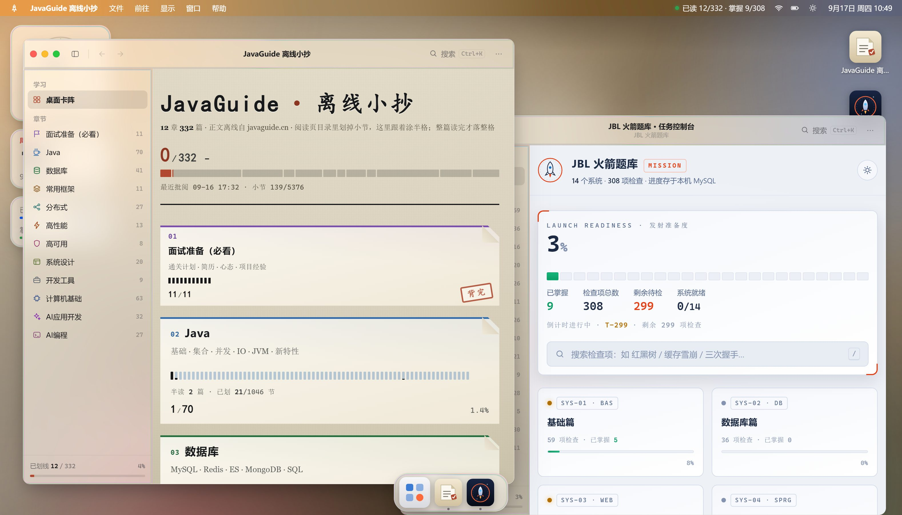
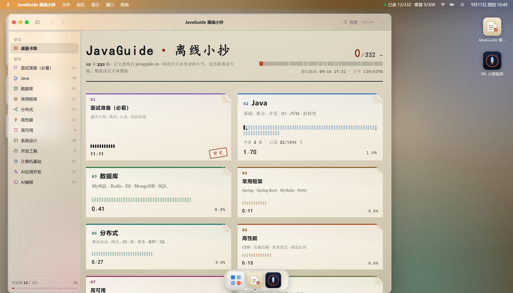
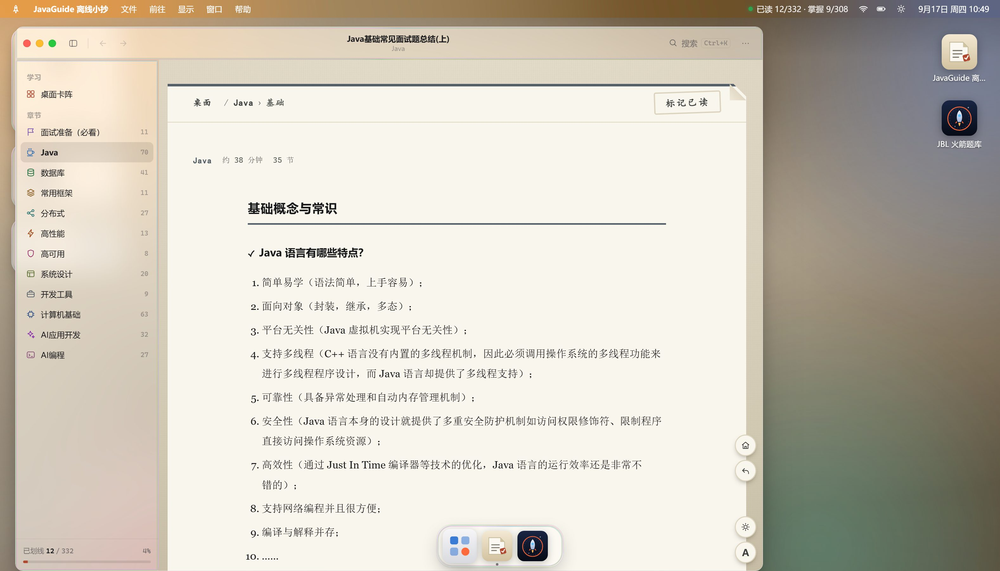
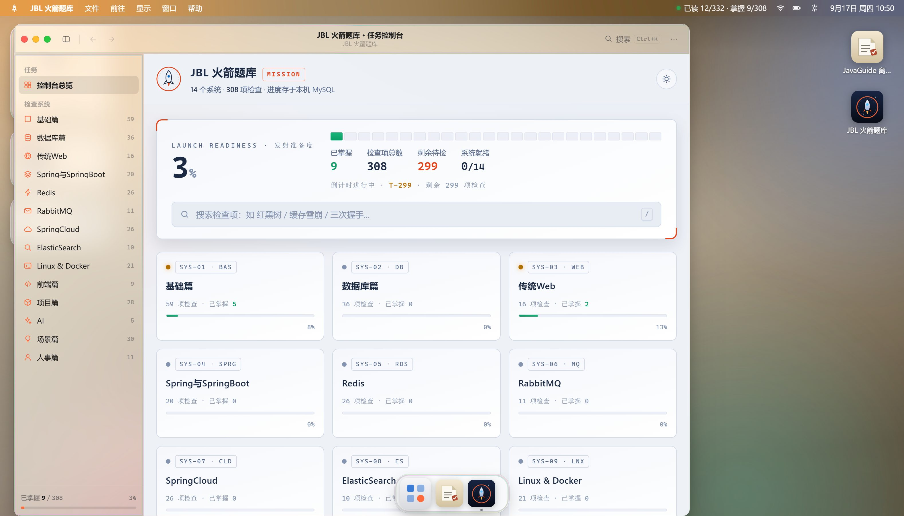
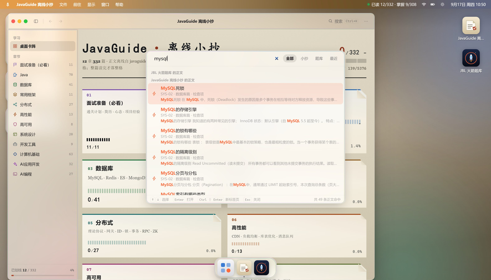

# 面试工作台（JavaGuide 离线小抄 + JBL 火箭题库）

把 [javaguide.cn](https://javaguide.cn) 的 **12 章 332 篇后端面试文章**与 **JBL 火箭题库的 14 章 308 题**搬进一块 **macOS 风格的桌面外壳**：多窗口、多标签、Dock、启动台、命令面板、可切换壁纸与液态玻璃材质。小抄是摊在暖亚麻案面上的**索引卡**——读一篇涂黑一格，整章读完盖「背完」章；题库是检查单——每题可标记「已掌握」。全站零外网依赖，进度持久化在本机 MySQL。

> 内容来自 JavaGuide（[@Snailclimb](https://github.com/Snailclimb)，CC BY-SA 4.0），本仓库只做**离线化 + 学习进度跟踪**，不改动、不重编原文。

## 界面速览

| 桌面 · 双应用并存 | JavaGuide 离线小抄 · 看板 |
| --- | --- |
|  |  |

| 阅读页 · 悬浮目录 | JBL 火箭题库 · 任务控制台 |
| --- | --- |
|  |  |

命令面板（`Ctrl K`，全局搜索两个应用的正文与检查项）：



## 它是什么

一个**单机自用**的学习工作台，前端是 Vue 3 + Vite 的 SPA（`client/`），后端是 Express + MySQL（`server/`），统一跑在 `http://localhost:3000`。

**桌面外壳**（液态玻璃世界）：

- 多窗口多标签：每应用一窗，标签历史前进/后退、拖拽排序、半屏分屏、会话恢复（刷新后窗口原样回来）。
- 菜单栏 / Dock / 启动台 / 命令面板（`Ctrl K` 全局搜索 752 条语料）/ 右键菜单 / 桌面小件。
- 深浅色（含跟随系统）+ 4 套纯 CSS 壁纸 + 液玻璃动效（追踪高光、边缘色散、点击涟漪，整体可关）；`prefers-reduced-motion` / 降低透明度 / 强制高对比色逐级降级。
- 侧栏联动：目录树、当前章高亮、进度条与「进度库未连接」降级提示。

**两个应用**（纸面世界）：

- **JavaGuide 离线小抄** — 12 张章卡的 bento 看板，每卡带完成格矩阵；阅读页代码高亮、mermaid 离线渲染、图片本地化、右侧悬浮目录卡（h2 折叠、状态按文章记住）；正文里的站内链接**全部内跳，不出站**。
- **JBL 火箭题库** — 独立静态站点（`JBL火箭题库/`），被外壳以 iframe 装载；逐题标记掌握，进度存 MySQL、localStorage 镜像，**双击 `index.html` 也能独立使用**。

**进度三级联动**（服务端事务裁决）：篇级「已读」与节级「逐节划掉」双向同步——小节全划完自动给整篇盖章，退掉任一节自动撤章；「读了一部分」在三个页面口径一致。

## 快速开始

**环境要求**：Node.js ≥ 18（本机 v22 验证）、MySQL ≥ 8（本机 8.4）。

```bash
git clone git@github.com:3247017691/JavaGuide-Notebook.git
cd JavaGuide-Notebook
npm install                   # 根依赖；会经 prepare 自动安装 git 钩子
npm --prefix client install   # 前端依赖（与根是分开的 node_modules）
npm run build:client          # 构建前端 → client/dist/（服务端只读这个）
npm start                     # → http://localhost:3000
```

打开 <http://localhost:3000>。**首次启动会自动建库、建表并导入目录**，无需手工准备数据库。

Windows 下也可以直接双击 **`启动离线小抄.bat`**：自动装依赖 → 关掉占用 3000 端口的旧进程 → 打开浏览器 → 启动服务。重复启动不会报 `EADDRINUSE`。

> ⚠️ **两条最容易踩的规矩**：
> 1. `npm run build` **不是**前端构建——它是内容管线（markdown → HTML）。前端构建是 **`npm run build:client`**，名字是反着的。
> 2. 服务端**只读 `client/dist`，不读 `client/src`**。改完前端不重新构建，页面毫无变化且**不报任何错**。

## 架构

```
浏览器
  └─ Express :3000  (server/index.js)
       ├─ /api/*                → routes/*（进度、目录、搜索）→ MySQL
       ├─ /jbl/*                → JBL火箭题库/（独立静态站点，被外壳 iframe 装载）
       ├─ /content /img /vendor → public/（内容管线产物）
       └─ /*  (SPA fallback)    → client/dist/（构建产物，不读源码）
```

## 目录结构

```
client/                     Vue 3 + Vite SPA（桌面外壳 + 小抄）
  src/components/shell/     外壳：菜单栏 / Dock / 启动台 / 命令面板 / WinFrame 窗口
  src/components/notebook/  小抄宿主：URL → 视图映射 + 索引卡视图
  src/lib/apps.js           ★ 应用注册表（单一事实来源：Dock / 标题 / 目录键）
  src/stores/               Pinia：窗口 / 偏好 / 目录与进度 / UI
  dist/                     构建产物（服务端唯一会读的前端目录）
server/                     Express + MySQL
  index.js                  装配 + /api 方法路径闸门（未登记的路由 404/405）
  context.js                目录（DESK_TOC）与搜索语料（构建期生成，进程内复用）
  statics.js                静态挂载：/jbl → /img → client/dist → /content /vendor → SPA fallback
  routes/                   overview / reads / jbl / desk 四组路由
  services/progress.js      篇⟺节联动（事务 + 行锁 + 死锁重试）
  db.js                     建库建表 + 目录种子导入
JBL火箭题库/                 独立静态站点（desk-bridge.js 是子应用↔外壳的 postMessage 桥）
public/content/             444 页正文 HTML（331 篇目录页 + 113 篇延伸页）
public/img/                 本地化图片（/img 挂载带魔数嗅探纠正 Content-Type）
public/vendor/mermaid/      mermaid 离线渲染
data/                       chapters.json 目录种子 · articles-meta.json · image-map.json
tools/                      preflight.mjs（本地 CI）· cdp-shot.mjs（无头截图）· cdp-scenes.mjs（15 档视觉矩阵）· push.bat（HTTPS 备用推送）
                            install-hooks.mjs + hooks/（pre-commit / pre-push git 钩子）
build-content.js            Markdown → HTML 渲染管线（高亮 / 锚点 / 容器 / mermaid / 站内链接本地化）
verify-links.js             构建后自检：外链残留 / 落点缺失 / 锚点错位（有问题非零退出）
download-images.js          图片本地化（undici 16 并发，重试 2 次）
server.js                   3 行兼容壳（等价 node server/index.js）
```

## 常用命令

| 命令 | 等价于 | 作用 |
| --- | --- | --- |
| `npm start` | `node server/index.js` | 起服务 `:3000`（首次自动建库导入目录） |
| `npm run dev:client` | `cd client && vite` | 前端热更新 `:5173`，API/内容自动代理到 3000 |
| `npm run build:client` | `cd client && vite build` | **前端构建** → `client/dist/` |
| `npm run build` | `node build-content.js` | **内容管线**：markdown → `public/content/*.html` |
| `npm run verify` | `node verify-links.js` | 内容自检（链接 / 落点 / 锚点） |
| `npm run fetch-images` | `node download-images.js` | 按 `image-map.json` 下载图片 |
| `npm run init-db` | `node server/db.js` | 建库建表导入目录（平时不需要，服务会自动做） |
| `npm run ci` | `node tools/preflight.mjs` | **提交前预检**（本项目的 CI，7 道闸含构建）。⚠️ 不是 `npm ci` |
| `npm run ci:fast` / `ci:e2e` | `… --skip-build` / `… --e2e` | 快速（跳过构建）/ 加无头浏览器验证 |
| `node tools/cdp-shot.mjs a.png [b.png]` | — | 无头 Chrome 截图（种子化会话，验样式用） |
| `node tools/cdp-scenes.mjs [--zoom]` | — | 15 档视觉矩阵回归：截图 + 材质/降级/破图/数据绑定断言，全绿退出码 0 |

**「改了什么 → 跑什么」口诀**：改前端 → `build:client`；改服务端 → 重启；改内容/题库 → 重跑对应管线 + 重启；提交前 → `npm run ci`。

## CI（本地预检 + git 钩子）

本项目是离线单机应用（依赖本机 MySQL、仓库 265MB），没有云 CI。`npm run ci` 一条命令跑完 **7 道闸**：A 前端构建 / B 构建产物 / C 内容自检 / D 应用注册表一致性（含「多应用泛化就绪度」）/ E 服务冒烟 / F 硬编码报告 / G 无头浏览器（`--e2e`）。

`npm install` 会经 `prepare` 自动装好两条 git 钩子（源码在 `tools/hooks/`）：

- **pre-commit** — 跑离线静态闸（不构建、不要求服务在跑，约 4s）；
- **pre-push** — 拦「改了 `client/src` 却没重新构建」。

急事绕过：`git commit/push --no-verify`；重装：`npm run prepare`。

## 内容更新 / 重新构建

内容源是 JavaGuide 官方仓库的 `docs/`（clone 到 `C:\tmp\JavaGuide`，或用环境变量 `JAVAGUIDE_REPO` 覆盖）。

```bash
node build-content.js      # docs/**/*.md → public/content/*.html + 元数据 + 图片清单
node verify-links.js       # 自检：外链残留 / 落点缺失 / 锚点错位（非零退出 = 有问题）
node download-images.js    # 下载图片到 public/img/（需代理时设 HTTPS_PROXY）
bash retry-curl.sh         # 用 curl 重试失败图片
```

**顺序不可颠倒**：`build` → `fetch-images` → `verify`（清单由 build 生成，verify 校验 build 的产物）。改完记得重启服务（`context.js` 启动时读元数据）。

题库同理：改了 `JBL火箭题库/tools/source.md` 后跑 `node tools/build.js`（在题库目录下）并重启。

### 站内链接本地化

正文里的 JavaGuide 站内链接一律指向本地，构建时做了：真路径规范化（`./` `../` 目录链、URL 编码）→ 文件名兜底（原站挪过目录的按文件名找落点）→ 锚点校验 → 别名表（`build-content.js` 的 `ALIASES`）。目录 332 篇里有 1 篇是站外链接无本地正文；此外被正文引用到的页面（`zhuanlan/`、`about-the-author/` 等）也一并渲染成 113 篇「延伸页」——只读、不计进度。结果是 `public/content/` 里只剩 3 条指向站点级文件的外链。

> 图片文件名由 URL 决定（`可读前缀-URL短哈希.ext`），不用递增序号——序号命名一旦换了遍历顺序就会整目录错位。

## 配置

| 变量 | 默认 | 说明 |
|---|---|---|
| `PORT` | `3000` | Web 端口 |
| `MYSQL_HOST` / `MYSQL_PORT` | `127.0.0.1` / `3306` | MySQL 地址 |
| `MYSQL_USER` / `MYSQL_PASSWORD` | `root` / `123456` | 账号 |
| `JAVAGUIDE_REPO` | `C:/tmp/JavaGuide/docs` | 内容源 |
| `HTTPS_PROXY` | `http://127.0.0.1:7892` | 仅图片下载用 |
| `JBL_OUT` | `JBL火箭题库/data.js` | 题库构建输出 |

启动期连不上 MySQL **进程不会退出**：服务照常监听，`/api/*` 返回 503 + 中文指引，库起来后刷新即可。

## API

| 方法 | 路径 | 依赖库 | 说明 |
|---|---|---|---|
| `GET` | `/api/meta` | ✗ | 全部文章元数据（445 条） |
| `GET` | `/api/overview` | ✓ | 各章统计 + 总进度 |
| `GET` | `/api/chapters/:code` | ✓ | 章明细（含每篇已读与本地路径） |
| `GET` | `/api/recent?limit=` | ✓ | 最近批阅（limit 钳制 0–50） |
| `GET` | `/api/reads` | ✓ | 已读篇 id 列表 |
| `GET` | `/api/section-reads?article=` | ✓ | 某篇已划小节 id 列表 |
| `POST` | `/api/read` | ✓ | `{id, read}` 单篇划线 / 撤线（含篇⟺节联动） |
| `POST` | `/api/section-read` | ✓ | `{article, heading, read}` 逐节划掉 |
| `POST` | `/api/bulk` | ✓ | `{code, read}` 整章批量 |
| `GET`/`POST` | `/api/jbl/progress` | ✓ | 题库掌握进度（GET 全量 / POST 单项） |
| `POST` | `/api/jbl/migrate` | ✓ | 浏览器进度搬进库（一次性，≤500 条） |
| `POST` | `/api/jbl/reset` | ✓ | 清空题库进度 |
| `GET` | `/api/desk` | ✗ | 外壳侧栏目录 |
| `GET` | `/api/search?q=&limit=` | ✗ | 全局搜索（limit 1–40，默认 24） |

`/api` 有方法/路径闸门：未登记的路径 404、方法不对 405（带 `Allow`），一律 JSON。三个小抄写接口都在事务里完成「篇 ⟺ 节」联动并返回联动后的状态，前端就地更新不回查。

## 开发文档（Agent Skills）

给 AI（新人）看的构建与扩展方法已固化成技能包：[`.zcode/skills/workbench-buildkit/`](.zcode/skills/workbench-buildkit/README.md)。

- **new-subapp** — 新增一个子应用的全链路（含必须先泛化的 8 个文件 11 处硬编码清单）
- **build-map** — 全部构建方法、命令矩阵、故障定位
- **headless-verify** — 无头 Chrome + CDP 验证改动
- **design-contract** — 视觉契约（玻璃 / 纸面两个世界、token 清单、禁止事项）

## 版权与致谢

- **内容**：© [JavaGuide](https://github.com/Snailclimb/JavaGuide)（snailclimb），[CC BY-SA 4.0](https://creativecommons.org/licenses/by-sa/4.0/)，署名保留在页脚。本仓库仅做离线化处理，未修改原文内容。
- **代码**：本仓库的构建脚本与前端代码以 [MIT](LICENSE) 许可发布。
