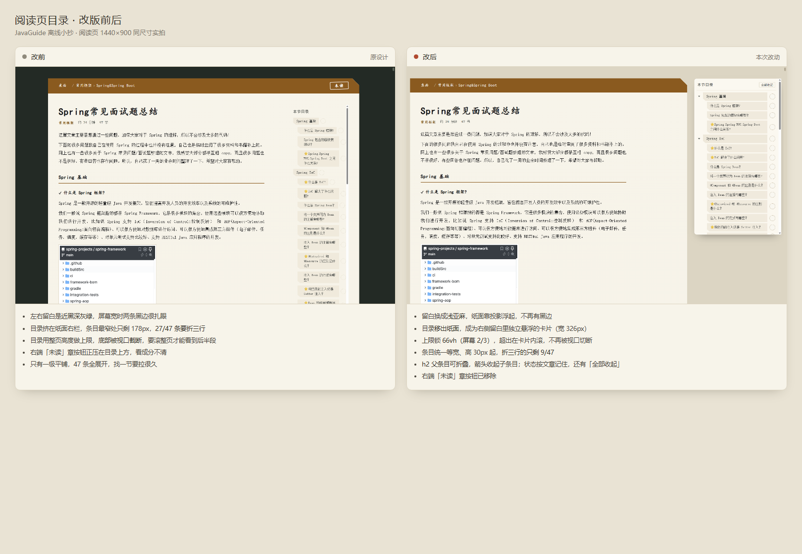

# JavaGuide 离线小抄

把 [javaguide.cn](https://javaguide.cn) 的 **12 章 332 篇后端面试文章全部搬到本地**，做成一本摊在暖亚麻案面上的**索引卡小抄**：读一篇涂黑一格，整章读完盖「背完」章。全站零外网依赖，进度持久化在 MySQL。

> 内容来自 JavaGuide（[@Snailclimb](https://github.com/Snailclimb)），本仓库只做**离线化 + 阅读进度跟踪**，不改动、不重编原文。

---



## 它是什么

一个**单机自用**的学习工具：把 JavaGuide 的知识体系变成可跟踪的阅读任务，首页像一份进度看板，每天打开一眼就知道还剩多少没读。

- **桌面（首页）** — 12 张章卡按 bento 版面铺开，每张卡带完成格矩阵（每格 = 1 篇，读完涂黑）、随进度变大的撕角、整章读完盖「背完」章。
- **章节卡（目录页）** — 该章全部篇目列表。点标题行即划线：穿孔「阅」＋ 波浪朱线逐行划过 ＋ 格表涂黑，三重记号；再点撤销。
- **文章页** — JavaGuide 原文离线阅读（代码高亮、mermaid 图、图片本地化），上下篇导航；正文里的站内链接**全部内跳，不出站**；右侧留白浮着一张限高 2/3 屏的**目录卡**，h2 可折叠、状态按文章记住。
- **进度三级联动** — 篇级「已读」与节级「逐节划掉」双向同步：小节全划完自动给整篇盖章，退掉任一节自动撤章；「读了一部分」在三个页面呈现一致。

划线有三处入口，服务端统一裁决、实时同步：**章节卡**（每篇一行，点一下整篇划/撤）、**文章页右上角**（整篇盖章）、**悬浮目录**（逐节划掉）。

## 快速开始

**环境要求**：Node.js ≥ 18（本机 v22 验证）、MySQL ≥ 8（本机 8.4）。

```bash
git clone https://github.com/3247017691/JavaGuide-Notebook.git
cd JavaGuide-Notebook
npm install
npm start
```

打开 <http://localhost:3000>。**首次启动会自动建库、建表并导入目录**，无需手工准备数据库。

Windows 下也可以直接双击 **`启动离线小抄.bat`**：自动装依赖 → 关掉占用 3000 端口的旧进程 → 打开浏览器 → 启动服务。重复启动不会报 `EADDRINUSE`。端口可用环境变量 `PORT` 覆盖。

> `启动离线小抄.bat` 的实现要点：`netstat -ano | findstr /r /c:":%PORT% .*LISTENING"` 取第 5 列拿 PID（模式带尾部空格，所以 `3999` 不会误伤 `39999`），再 `taskkill /f /pid`；文件存成 **CRLF + UTF-8 无 BOM**（cmd 解析 `for /f` 多行块对 LF 不友好）。

## 目录结构

```
server.js / db.js          Express + MySQL（API、建库导入、进度对账）
build-content.js           Markdown → HTML 渲染管线（高亮 / 锚点 / 容器 / mermaid / 站内链接本地化）
verify-links.js            构建后自检：外链残留 / 落点缺失 / 锚点错位
download-images.js         图片本地化（undici 并发下载）
retry-curl.sh              失败图片 curl 重试
data/chapters.json         12 章 332 篇目录（源自 JavaGuide 侧边栏配置）
data/articles-meta.json    每页的 TOC / 阅读时长 / 本地产出路径（含延伸页）
data/image-map.json        图片 URL → 本地文件名
public/content/            渲染后的 444 页正文 HTML（331 篇目录页 + 113 篇延伸页）
public/img/                本地化图片
public/vendor/mermaid/     mermaid 离线渲染
public/{index,chapter,read}.html + cheat.css + *.js    小抄卡前端
```

## 内容更新 / 重新构建

内容源是 JavaGuide 官方仓库的 `docs/`（clone 到 `C:\tmp\JavaGuide`，或改 `build-content.js` 里的 `REPO` 路径）。

```bash
node build-content.js      # docs/**/*.md → public/content/*.html + 元数据 + 图片清单
node verify-links.js       # 自检：外链残留 / 落点缺失 / 锚点错位（缺失或错位会非零退出）
node download-images.js    # 下载图片到 public/img/（需代理时设 all_proxy / HTTPS_PROXY）
bash retry-curl.sh         # 用 curl 重试失败图片
```

站点数据（章 / 篇 / 已读）在 MySQL；`data/chapters.json` 是目录种子，删库重启会重新导入。

## 站内链接本地化

正文里的 JavaGuide 站内链接**一律指向本地**，不跳官网。构建时做了这些事：

- **真路径规范化**：用 `path.posix.normalize` 解析 `./`、`../`、目录链（`xxx/` → `xxx/README.html`）、无扩展名和 URL 编码。
- **文件名兜底**：原站改版把文章挪过目录时，按文件名在全仓索引里找落点；同名文件取路径前缀最接近的那个。
- **延伸页**：332 篇目录里有 1 篇（`09-009 IDEA`）本身就是站外链接、无本地正文，其余 331 篇之外被链接到的页面（`zhuanlan/`、`about-the-author/` 等）也一并渲染，共 113 篇。它们只读、不计入进度，阅读页显示「延伸页」。
- **锚点校验**：链接带 `#锚点` 时先确认目标页真有这个 id，对不上就丢掉 hash。
- **别名表**：原站已删除的老地址在 `build-content.js` 的 `ALIASES` 里手工指向现在的页面。

结果是 `public/content/` 里只剩 3 条 javaguide.cn 外链，指向本仓库确实没有的站点级文件。改完记得 `node verify-links.js` 过一遍。

> 图片文件名由 URL 决定（`可读前缀-URL短哈希.ext`），不用递增序号——序号命名一旦换了遍历顺序就会整目录错位。

## 阅读页版式

`.read-sheet` 是「目录 + 纸面」的两列网格：`.read-clip` 是纸面本体（撕角、投影），`.toc` 是**左侧**留白里的目录卡。

| 环节 | 做法 |
|---|---|
| 桌面底色 | `--desk` 浅亚麻（`#e7e0cd`），纸面靠投影浮起 |
| 目录位置 | 在纸面**之外左侧**的留白里，`position: sticky; top: var(--pad-y)` 悬浮 |
| 列排布 | 栅格 `var(--toc-w) minmax(0,1fr)`；目录 / 纸面用显式 `grid-area` 摆位，DOM 里纸面仍排在目录前——窄屏塌成 block 时顺序自然是「正文在上、目录在下」 |
| 目录宽度 | `--toc-w: clamp(238px, 22vw, 330px)` |
| 高度上限 | `max-height: calc(100vh - var(--pad-y) * 2)`，超出在卡内滚（`overscroll-behavior: contain`） |
| 父子折叠 | h2 为父条目带三角，h3 为子条目；状态存 `localStorage["toc-collapsed:<文章id>"]` |
| 窄屏 | `≤1024px` 时目录回落到纸面下方，铺成便签云，不折叠 |

目录卡必须在 `.read-clip` **之外**——纸面带 `clip-path`（撕角），fixed/sticky 的子元素会被一起裁掉。

## 配置

| 变量 | 默认 | 说明 |
|---|---|---|
| `MYSQL_HOST` / `MYSQL_PORT` | `127.0.0.1` / `3306` | MySQL 地址 |
| `MYSQL_USER` / `MYSQL_PASSWORD` | `root` / `123456` | 账号 |
| `PORT` | `3000` | Web 端口 |
| `HTTPS_PROXY` | — | 仅图片下载时使用 |

## API

| 方法 | 路径 | 说明 |
|---|---|---|
| `GET` | `/api/overview` | 各章统计 + 总进度 |
| `GET` | `/api/reads` | 已读 id 列表 |
| `GET` | `/api/chapters/:code` | 章明细（含每篇已读与本地路径） |
| `GET` | `/api/meta` | 全部文章元数据 |
| `GET` | `/api/recent` | 最近批阅 |
| `POST` | `/api/read` | `{id, read}` 单篇划线 / 撤线 |
| `POST` | `/api/bulk` | `{code, read}` 整章批量 |

三个写接口都会在事务里完成「篇 ⟺ 节」联动，并返回联动后的状态（`articleRead` / `sectionsRead` / `sectionsTotal`），前端就地更新。

## 版权与致谢

- **内容**：© [JavaGuide](https://github.com/Snailclimb/JavaGuide)（snailclimb），[CC BY-SA 4.0](https://creativecommons.org/licenses/by-sa/4.0/)，署名保留在页脚。本仓库仅做离线化处理，未修改原文内容。
- **代码**：本仓库的构建脚本与前端代码以 [MIT](LICENSE) 许可发布。
